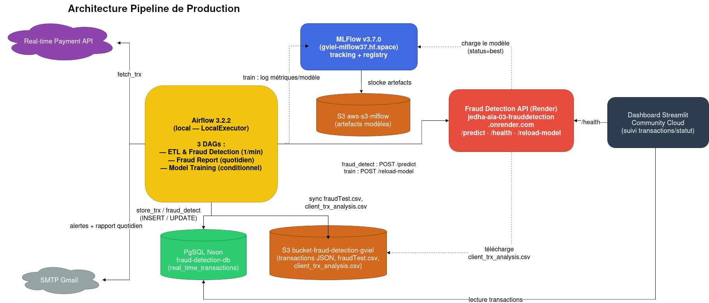

# Fraud Detection — Jedha RNCP7 AIA Bloc 3

Pipeline ML de détection de fraude bancaire en production : préparation des données,
entraînement/sélection de modèle, API de scoring temps réel, orchestration Airflow, et dashboard
de suivi.

Projet de certification Jedha RNCP7 Bloc 3 (Architecte IA).

Dépot GitHub : https://github.com/gviel/jedha-aia-03-frauddetection

Présentation : `docs/AIA_bloc3_fraud_detection_GV.pptx`


## Voir le projet en marche

| Service | URL |
|---|---|
| Dashboard de suivi (Streamlit) | https://jedha-aia-03-frauddetection-vs7adfbiy54amcv5jqy3gc.streamlit.app/ |
| API de prédiction (Render) | https://jedha-aia-03-frauddetection.onrender.com/docs |
| MLFlow (tracking des modèles) | https://gviel-mlflow37.hf.space/ |

Le dashboard affiche les transactions temps réel collectées par le pipeline (score de fraude,
filtres par jour/niveau de risque) ainsi que le statut de l'API/modèle en production. `/docs` sur
l'API expose un Swagger avec des exemples pour tester `/predict` directement.

[Vidéo de démo de l'architecture](https://youtu.be/8zfDwdCbX2Q)

## Fonctionnement (vue d'ensemble)

| Étape | Composant | Rôle |
|---|---|---|
| 1 | `src/prepare_dataset.py` | `data/fraudTest.csv` (dataset historique labellisé) → `work/fraudTest_prepared.csv` + `work/client_trx_analysis.csv` (feature engineering : `distance_km`, `diff_avg_amt`, `hour`, `dow`...) |
| 2 | `src/train.py` | Entraîne 5 modèles candidats (`config/models.yaml`), log tracking + registry dans MLFlow (artefacts sur S3 `aws-s3-mlflow`), tague le meilleur `status=best` sur PR-AUC |
| 3 | `api/app.py` (FastAPI) | Charge le modèle `status=best` depuis MLFlow ; expose `POST /predict`, `GET /health`, `POST /reload-model` |
| 4 | `dags/` (Airflow, local), 3 DAGs | `dag_etl_fraud_detection` (1×/min) : collecte une transaction (API Jedha), la fait scorer par l'API, alerte par email si fraude, écrit en base PostgreSQL (Neon en prod) et sur S3, enrichit le dataset d'entraînement · `dag_report` : rapport de fraudes par email · `dag_train_model` : ré-entraîne le modèle quand le dataset a grossi, redéploie automatiquement le nouveau modèle si c'est le meilleur au global |
| 5 | `dashboard/app.py` (Streamlit) | Visualise les transactions de `real_time_transactions` (Neon) |




## Stack technique

- Python 3.12
- scikit-learn / XGBoost / LightGBM
- MLFlow
- FastAPI
- Apache Airflow 3.2
- PostgreSQL (Neon en prod)
- S3 (AWS)
- Streamlit
- Docker / Docker Compose

## Lancer le projet en local

```bash
make venv && make prepare && make train    # pipeline ML (prépare le dataset, entraîne les modèles)
make api                                   # API FastAPI en local (http://localhost:8000/docs)
make test                                  # tests unitaires (src/)
```

Stack complète en local (API + PostgreSQL) :
```bash
docker compose --env-file api/.env.test up --build
```

Stack Airflow (DAGs 3.1/3.2/3.3) :
```bash
./airflow/start.sh               # mode test (par défaut)
APP_ENV=prod ./airflow/start.sh  # simulation locale du mode prod (Neon + S3)
```

Chaque application a son propre fichier d'environnement à copier avant de démarrer —
`api/.env.template`, `airflow/.env.template`, `dashboard/.env.template` (voir les commentaires de
chacun pour le détail des variables).

## Structure du dépôt

```
data/                  dataset historique brut
work/                  sorties intermédiaires (gitignoré)
model/                 modèle local pour les tests (gitignoré)
src/                   préparation du dataset + entraînement
api/                   API FastAPI de prédiction
dags/                  DAGs Airflow + tâches
airflow/               stack Docker Compose Airflow
dashboard/             dashboard Streamlit de suivi
config/models.yaml     modèles à entraîner + config resampling
tests/                 tests unitaires (src/)
docs/                  documentation du projet
```

## Documentation

- [`specs.md`](specs.md) — spécifications détaillées, phase par phase
